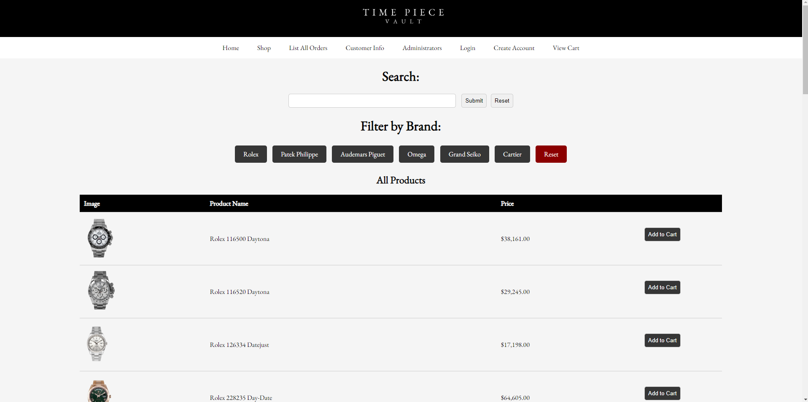
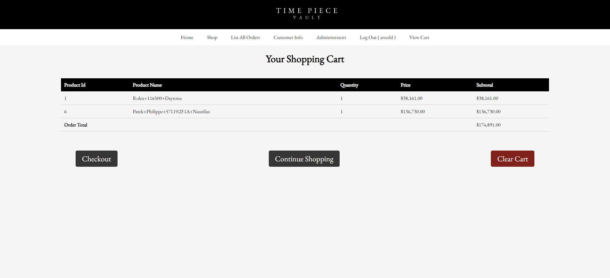
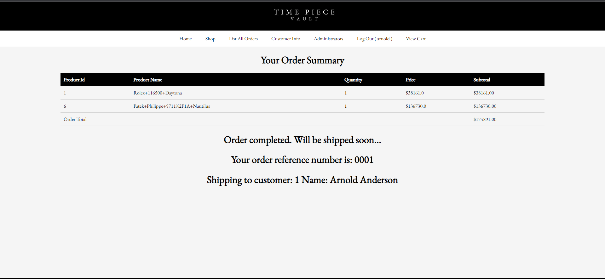

# COSC-304-Final-Project
Created By: Justin Drenka, Kyle Mcleod

---
# What is WatchStore?
Time Peice Vault is our dynamic online watch shop that offers a variety of luxury brands and models to choose from. 
You cannot actually purchase anything but the database and website is set up as if it were a real watch store. 

# What Features? 

  - Account Creation
  - User authentication
  - Shopping cart saved between sessions
  - Admin panel with sales and inventory analysis
  - Search bar functionality
  - List all orders (For admins)

# Walkthrough

---

---

---

---

---

---

# Tech Stack

  - Java
  - JSP Pages
  - HTML/CSS
  - SQL
  - Docker

